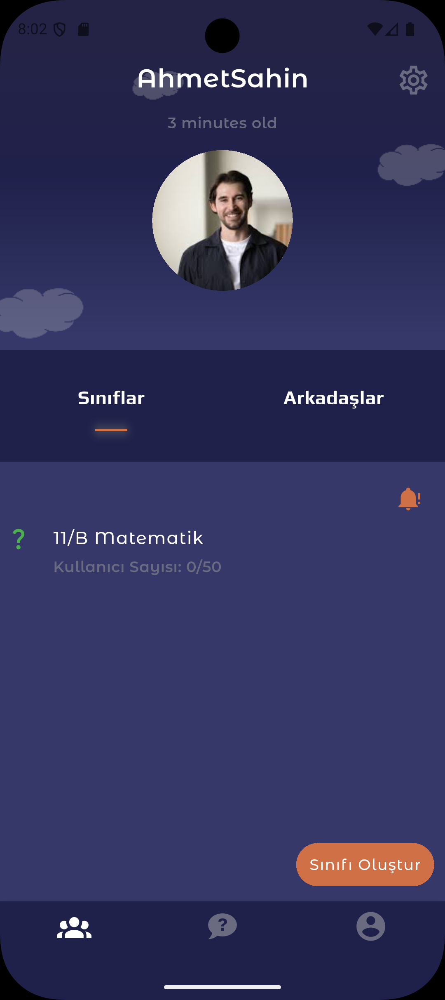
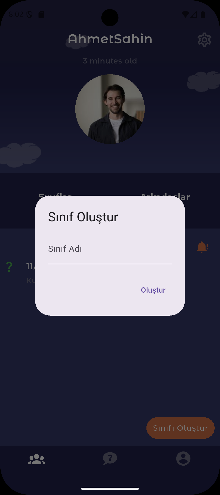
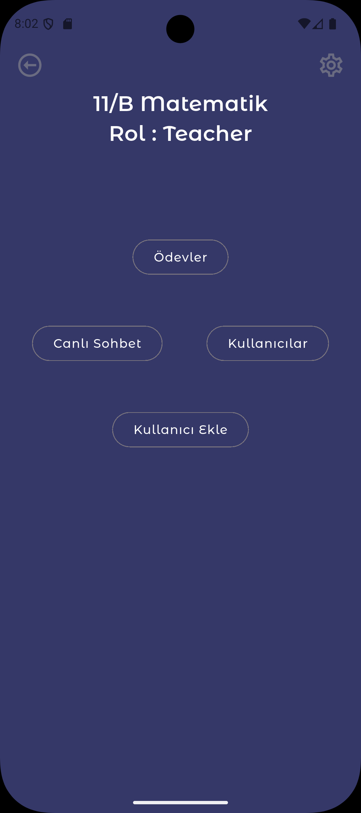
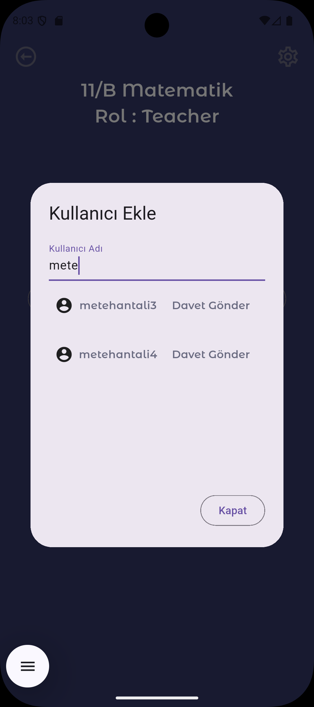
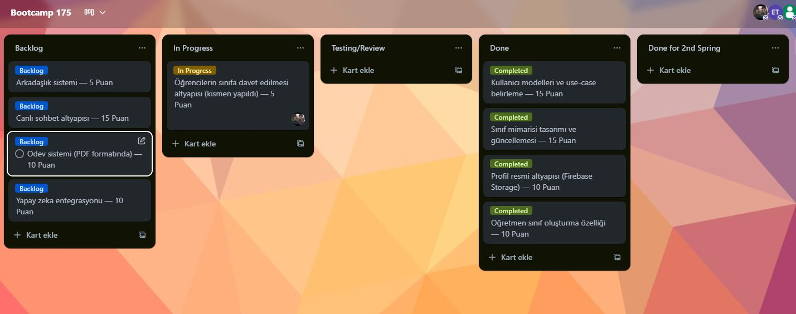
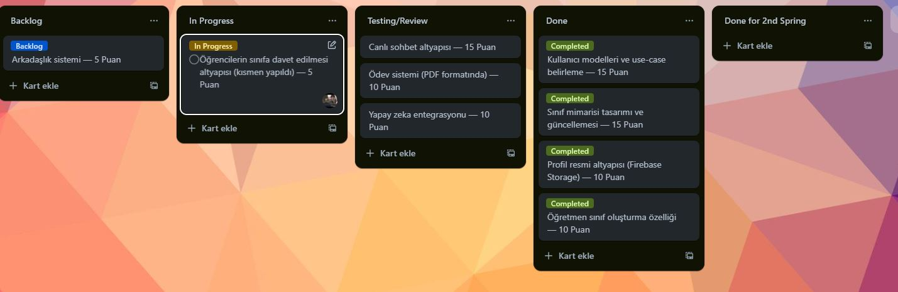
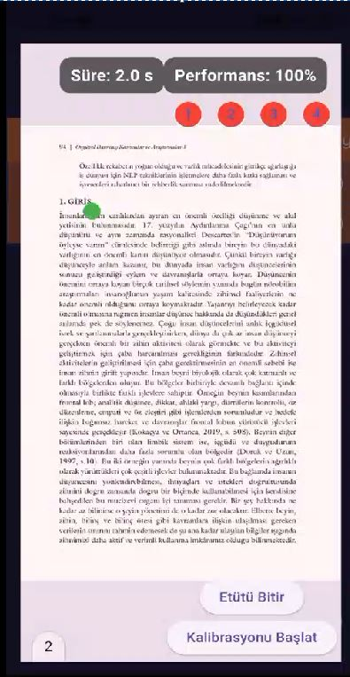
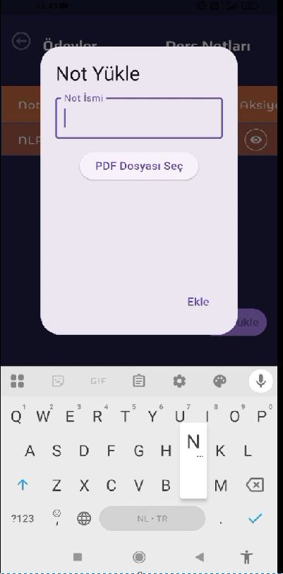

# BootcampAI

## Yapay Zekâ Destekli Etüt Takip Uygulaması

---

## 👥 Takım & Ürün İsmi

**Takım Adı:** Bootcamp Grup 175  
**Ürün Adı:** Etüt

---

## 📌 Takım Üyeleri

- Sudenaz Şahan
- Esra Tosun
- Metehan Murad Tali
- Alperen Tekeli
- Mustafa

---

## 📝 Ürün Tanımı

**Etüt**, öğrencilerin bireysel çalışma süreçlerini verimli hale getirmeyi amaçlayan, **yüz takibi** ve **yapay zekâ destekli analiz** sunan bir etüt platformudur. Öğrenciler çalışırken ekran takibiyle ne kadar odaklandıkları ölçülür, çalıştıkları içeriklerde zorlandıkları noktalar yapay zekâ tarafından analiz edilerek onlara özel **bilgi baloncukları** ve **özetler** sunulur.

Etüt, bireysel verimliliği artırmakla kalmaz; rehber öğretmenlerin öğrencilerin gelişimlerini takip etmesini sağlar. Sosyal etkileşim alanlarıyla öğrencilerin sorularını paylaşmasına ve birlikte öğrenmesine olanak tanır.

Amacımız, öğrencilerin sürdürülebilir bir öğrenme disiplini geliştirmesine katkı sağlamak ve onların yanında olan akıllı bir yardımcı sunarak öğrenmeyi daha **etkili**, **sosyal** ve **şeffaf** hale getirmektir.

---

## 🔧 Ürün Özellikleri

### 🎥 Yüz Takibi ve Odak Ölçümü

- Face Tracking teknolojisiyle ekrana bakma süresi ölçülür, odak seviyesi analiz edilir.

### 📖 Akıllı İçerik Analizi

- Sayfada uzun kalındığında, AI arka planda içerikle ilgili araştırma yaparak bilgi baloncukları sunar.

### 📊 Etüt Analizi ve Raporlama

- Toplam çalışma süresi
- Odaklanma süresi
- Takıldığı sayfalar
- Genel verimlilik skoru  
  → Etüt sonunda sunulur.

### 🧑‍🏫 Rehberlik Paneli

- Öğrencinin geçmiş verileri rehber öğretmenle paylaşılır.
- Öğrenciye özel öneriler sunulur.

### 🤖 AI Destekli Gelişim Önerileri

- Zorlandığı konular
- Tekrar çalışması gereken alanlar
- Uygun kaynak önerileri sunulur.

### 📚 Konu ve Seviye Takibi

- Öğrenci hangi konuları tamamladığını işaretleyebilir.
- Seviye bazlı öneriler sunulur.

### 🆚 Karşılaştırmalı Başarı ve İlerleme

- Başarı sırası
- Tamamlanan konular
- Diğer öğrencilerle karşılaştırma yapılabilir.

### 💬 Öğrenci Sohbet Alanı

- Grup çalışmaları, soru paylaşımları ve sohbet desteklidir.

### 📝 Çalışma Özetleri Paylaşımı

- Etüt sonunda çıkan özetler arkadaşlarla paylaşılabilir.

### 🌍 Çoklu Dil Desteği

- Türkçe ve İngilizce başta olmak üzere çoklu dil desteği mevcuttur.

### 🔐 Güvenli Giriş ve Veri Koruması

- Email ile kayıt yapılır.
- Kullanıcı verileri gizlilik esasına göre saklanır.

---

## 🎯 Hedef Kitle

Etüt'ün hedef kitlesi, özellikle **Z Kuşağı** ve **üniversite öğrencileridir**. Teknolojiyi aktif kullanan, verimli çalışma alışkanlıkları kazanmak isteyen ve bireysel gelişimine önem veren genç bireyler bu uygulamadan doğrudan fayda sağlar.

### 💡 Öne Çıkan Kitleler:

- Sınavlara hazırlanan öğrenciler
- Ödev ve proje yoğunluğu yaşayan bireyler
- Dikkat dağınıklığı yaşayanlar
- Rehberlik desteğine ihtiyaç duyan ama yeterince ilgi göremeyen öğrenciler
- Eğitimde fırsat eşitliği arayan bireyler
- Rehber öğretmenler, eğitim koçları ve veli grupları

---

## Sprint 1 Notları

- Sprint Tarihleri: (20 Haziran 2025 – 6 Temmuz 2025)

### Genel Amaç ve Planlama

- Sprint 1'de uygulamanın temel planlaması ve teknik altyapısı üzerine çalışıldı:

- Uygulama Konusu belirlendi. Eğitim alanında, öğrenci-veli-öğretmen-yonetici rollerini destekleyen, yapay zeka destekli bir mobil uygulama olarak planlandı.

- Temel feature listesi çıkarıldı.

- Uygulamanın platformu mobil olarak belirlendi.

- Teknoloji olarak Flutter + Firebase seçildi.

- Takım içi rol dağılımı yapıldı.

### Yapılan Teknik Çalışmalar

✅ Dosya Mimarisi oluşturuldu. Proje yapısı temiz ve sürdürülebilir bir şekilde organize edildi.

✅ Flutter – Firebase Auth bağlantısı kurularak kullanıcı kimlik doğrulama altyapısı hazırlandı.

✅ Firebase Cloud Functions kullanılarak backend tarafında güvenlik ve işlem mantığı desteklendi.

✅ Başlangıç UserModel'i tanımlanarak temel kullanıcı veri modeli oluşturuldu.

✅ Giriş ve Kayıt Ekranı oluşturuldu, çalışır durumda.

✅ Bloc kütüphanesi projeye entegre edildi. Uygulama artık dinamik state management destekliyor.

### Sprint Değerlendirmesi

- Geliştirme süreci başarılı şekilde ilerlemekte.

- Temel altyapı tamamlandı, sonraki sprintte temel ekranlar ve işlevsel özellikler geliştirilecek.

- Takım içi iletişim ve görev dağılımı verimliydi.

### Sprint 1 Sonrası Trello Board Özeti

### Uygulama Kayıt Sayfası Ekran Görüntüsü

## Sprint 2 Notları

- Sprint Tarihleri: (6 Temmuz 2025 – 20 Temmuz 2025)

## ✅ Highlights

- Kullanıcı modelleri ve use-case'leri belirlendi.
- Sınıfların mimarisi tasarlandı ve mevcut yapıya göre güncellendi.
- Profil resmi sistemi için altyapı oluşturuldu; **Firebase Storage** kullanımına karar verildi.
- Öğretmenler için sınıf oluşturma özelliği geliştirildi.
- Öğrencileri sınıfa davet edebilme altyapısı hazırlandı (tamamlanmadı).
- Ödev sistemi için **PDF** kullanılması kararlaştırıldı (uygulama yapılmadı).
- Canlı sohbet sistemi planlandı, ancak uygulamaya geçirilmedi.
- Yapay zeka için **Firebase Genkit** veya **AI Logic** kullanımı düşünüldü, ancak henüz entegre edilmedi.
- Arkadaşlık sistemi planlandı ancak bu sprintte başlanmadı.

---

## 📌 Sprint Scope Decisions

- Profil fotoğrafı yönetimi için **Firebase Storage** kullanılacak.
- Ödev sistemi PDF formatına göre tasarlanacak.
- Canlı sohbet sistemi oluşturulacak (bir sonraki sprintte).
- Yapay zekâ çözümleri olarak Firebase Genkit / AI Logic değerlendirilecek.
- Sosyal etkileşim için arkadaşlık sistemi planlandı.

---

## 🎯 Expected Point Completion within Sprint

**100 points**

---

## 📊 Sprint Point Completion Breakdown

| İş Kalemi                                          | Durum             | Puan (Tamamlanan) | Toplam Puan |
| -------------------------------------------------- | ----------------- | ----------------- | ----------- |
| Kullanıcı modelleri ve use-case'lerin belirlenmesi | ✅ Tamamlandı     | **15**            | 15          |
| Sınıf mimarisinin tasarlanması ve güncellenmesi    | ✅ Tamamlandı     | **15**            | 15          |
| Profil resmi altyapısı (Firebase Storage)          | ✅ Tamamlandı     | **10**            | 10          |
| Öğretmen sınıf oluşturma özelliği                  | ✅ Tamamlandı     | **10**            | 10          |
| Öğrencileri sınıfa davet altyapısı                 | ⚠️ Kısmen Yapıldı | **5**             | 10          |
| Ödev sistemi (PDF)                                 | ❌ Yapılmadı      | **0**             | 10          |
| Canlı sohbet altyapısı                             | ❌ Yapılmadı      | **0**             | 15          |
| Yapay zeka çözümü                                  | ❌ Yapılmadı      | **0**             | 10          |
| Arkadaşlık sistemi                                 | ❌ Yapılmadı      | **0**             | 5           |

- ✅ **Toplam Tamamlanan Puan**: **55**
- ⚠️ **Kısmen Yapılan Puan**: **5**
- ❌ **Tamamlanamayan Puan**: **40**

---

## 📈 Sprint Başarı Oranı

\[
\text{Gerçekleşen Puan} = 55 (tamamlanan) + 5 (kısmi) = 60
\]

\[
\text{Başarı Yüzdesi} = \left( \frac{60}{100} \right) \times 100 = \boxed{60\%}
\]

---

## 🔁 Sprint Review

- Kullanıcı senaryoları ve modelleri başarıyla tanımlandı.
- Sınıf sistemi mimarisi oluşturuldu ve uygulamaya entegre edildi.
- Profil fotoğrafı yükleme altyapısı kuruldu (Firebase Storage ile).
- Öğretmenlerin sınıf oluşturması sağlandı.
- Öğrencileri sınıflara davet edebilme altyapısı kuruldu fakat tamamlanmadı.
- Ödev sistemi için PDF kullanılmasına karar verildi, ancak sistem eklenmedi.
- Canlı sohbet sistemi planlandı fakat uygulamaya başlanmadı.
- Yapay zeka servisleri araştırıldı ancak henüz uygulamaya alınmadı.
- Arkadaşlık sistemi bu sprintte ele alınamadı.

---

## 🔎 Sprint Retrospective

- Canlı sohbet sistemi bir sonraki sprintte geliştirilecek.
- Ödev sistemi uygulaması tamamlanacak.
- Arkadaşlık sistemi için tasarım ve geliştirme süreci başlatılacak.
- Öğrencileri davet sistemi tamamlanarak test edilecek.
- Yapay zeka servislerinin POC çalışması yapılacak.
- Kullanıcı tarafında UX iyileştirmeleri yapılacak.

## Ekran Görüntüleri

## Sprint Görüntüleri

## Sprint 3 Notları

- Sprint Tarihleri: (20 Temmuz 2025 – 3 Ağustos 2025)

## ✅ Highlights

- **Ödev/Not Yükleme Sistemi**: PDF dosyalarının yüklenmesi ve yönetimi için tam fonksiyonel sistem geliştirildi.
- **Yapay Zeka ile Eye Tracking**: Kullanıcıların göz hareketlerini takip eden AI destekli sistem entegre edildi.
- **PDF Viewer Entegrasyonu**: PDF dosyalarının görüntülenmesi için Syncfusion PDF Viewer entegre edildi.
- **Kullanıcı Takılma Noktası Tespiti**: Kullanıcıların en çok hangi bölümlerde takıldığının analizi gerçekleştirildi.
- **DataTable Layout**: Ödevler sayfası için DataTable tabanlı layout kullanıldı.
- **Dialog Widget İyileştirmeleri**: PDF görüntüleme ve etüt takibi için gelişmiş dialog widget'ları.

---

## 🔧 Fonksiyonel Özellikler

### Ödev/Not Yükleme Sistemi

- PDF dosya yükleme ve yönetimi
- Dosya seçimi ve validasyon
- Firebase Storage entegrasyonu
- Ödev ismi ve açıklama ekleme
- Yüklenen dosyaların listelenmesi

### Yapay Zeka ile Eye Tracking

- Gerçek zamanlı göz hareketi takibi
- Odaklanma süresi ölçümü
- Ekran dışı süre tespiti
- Performans analizi ve raporlama
- Kalibrasyon sistemi

### PDF Viewer Entegrasyonu

- Syncfusion PDF Viewer implementasyonu
- Yatay kaydırma desteği
- Sayfa navigasyonu
- Zoom ve pan özellikleri
- PDF içeriği analizi

### Kullanıcı Takılma Noktası Tespiti

- Sayfa segmentasyonu (4 bölüm)
- Her segment için ayrı takip
- Takılma süresi analizi
- AI destekli içerik analizi
- Otomatik özet oluşturma

### DataTable Layout

- Ödevler için DataTable kullanımı
- Sütun bazlı düzenleme
- Arama ve filtreleme
- Responsive tablo tasarımı
- Aksiyon butonları entegrasyonu

### Dialog Widget İyileştirmeleri

- PDF görüntüleme dialog'u
- Etüt takip arayüzü
- Gerçek zamanlı metrikler
- Segment durumu göstergeleri
- Kontrol butonları

---

## 📊 Sprint Point Completion Breakdown

| İş Kalemi                         | Durum         | Puan (Tamamlanan) | Toplam Puan |
| --------------------------------- | ------------- | ----------------- | ----------- |
| Ödev/Not Yükleme Sistemi          | ✅ Tamamlandı | **25**            | 25          |
| Yapay Zeka ile Eye Tracking       | ✅ Tamamlandı | **30**            | 30          |
| PDF Viewer Entegrasyonu           | ✅ Tamamlandı | **15**            | 15          |
| Kullanıcı Takılma Noktası Tespiti | ✅ Tamamlandı | **20**            | 20          |
| DataTable Layout                  | ✅ Tamamlandı | **10**            | 10          |
| Dialog Widget İyileştirmeleri     | ✅ Tamamlandı | **10**            | 10          |

- ✅ **Toplam Tamamlanan Puan**: **110**
- ⚠️ **Kısmen Yapılan Puan**: **0**
- ❌ **Tamamlanamayan Puan**: **0**

---

## 📈 Sprint Başarı Oranı

\[
\text{Gerçekleşen Puan} = 110 (tamamlanan) + 0 (kısmi) = 110
\]

\[
\text{Başarı Yüzdesi} = \left( \frac{110}{110} \right) \times 100 = \boxed{100\%}
\]

---

## 🔁 Sprint Review

### Başarıyla Tamamlanan Özellikler

✅ **Ödev/Not Yükleme Sistemi**: PDF dosya yükleme ve yönetimi tamamlandı
✅ **Yapay Zeka ile Eye Tracking**: Gerçek zamanlı göz takibi sistemi entegre edildi
✅ **PDF Viewer Entegrasyonu**: Syncfusion PDF Viewer başarıyla entegre edildi
✅ **Kullanıcı Takılma Noktası Tespiti**: Segment bazlı analiz sistemi geliştirildi
✅ **DataTable Layout**: Ödevler sayfası için DataTable implementasyonu
✅ **Dialog Widget İyileştirmeleri**: PDF görüntüleme ve etüt takibi dialog'ları

### Teknik İyileştirmeler

- **Firebase Storage**: PDF dosya yönetimi için Firebase Storage entegrasyonu
- **Eye Tracking API**: Eyedid Flutter plugin entegrasyonu
- **AI Integration**: Firebase AI ile içerik analizi
- **PDF Processing**: PDF metin çıkarma ve segmentasyon
- **Real-time Analytics**: Gerçek zamanlı performans analizi

---

## 🔎 Sprint Retrospective

### Güçlü Yönler

- **100% Başarı Oranı**: Tüm planlanan özellikler başarıyla tamamlandı
- **AI Integration**: Yapay zeka ile eye tracking başarıyla entegre edildi
- **PDF Management**: Kapsamlı PDF yönetim sistemi geliştirildi
- **User Analytics**: Detaylı kullanıcı analiz sistemi oluşturuldu
- **Technical Excellence**: Karmaşık teknik özellikler başarıyla implement edildi

### Gelecek Sprint Hedefleri

- **Performance Optimization**: Eye tracking performansının iyileştirilmesi
- **Advanced Analytics**: Daha detaylı kullanıcı analizleri
- **Mobile Optimization**: Mobil cihazlarda performans iyileştirmeleri
- **User Testing**: Kullanıcı testleri ve geri bildirim toplama
- **Feature Enhancement**: Mevcut özelliklerin geliştirilmesi

### Öğrenilen Dersler

- Eye tracking teknolojisinin entegrasyonu ve optimizasyonu
- PDF işleme ve analiz teknikleri
- AI destekli içerik analizi metodları
- Gerçek zamanlı veri analizi ve raporlama
- Karmaşık sistem entegrasyonları

---

## 🎨 Sprint 3 Teknik Görselleri

### PDF Viewer ve Eye Tracking Sistemi

### Ödev Yükleme Sistemi

